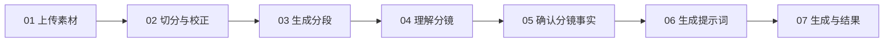
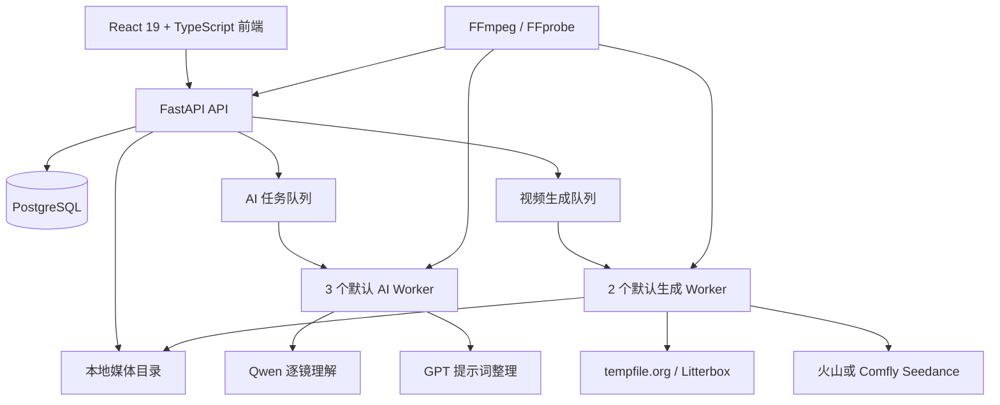

# AdFrame 广告视频改编工作台

## 项目介绍与技术交接报告

**文档用途：** 面向项目接手公司、技术团队、产品团队与实施团队的统一介绍材料

**报告日期：** 2026 年 8 月 26 日

**当前正式版本：** v0.1.0

**代码仓库：** <https://github.com/Aaaaqiiii/AdFrame>（私有仓库）

**正式发布页：** <https://github.com/Aaaaqiiii/AdFrame/releases/tag/v0.1.0>

---

## 1. 项目概述

AdFrame 是一套面向广告视频改编场景的本地工作台。系统以一条参考广告视频为基础，将素材管理、视频切分、逐镜视觉理解、人物与产品替换、提示词生成、视频模型提交、任务追踪和结果合并组织成一条可人工校对、可保存版本、可恢复执行的完整流程。

项目主要解决以下业务问题：

1. 将原本分散在视频播放器、视觉模型、提示词工具和视频生成平台中的操作集中到同一工作台。
2. 将参考视频拆解为可核对的镜头事实，降低 AI 对人物、产品、动作、字幕和镜头结构的误解。
3. 在“保留原产品”和“替换目标产品”两种业务模式下，分别执行对应的产品约束。
4. 让人工确认结果成为后续提示词和视频生成的正式输入，避免模型中间结果直接覆盖人工判断。
5. 将长视频按照供应商时长限制分段生成，并在所有片段完成后合并为一条完整视频。

截至本报告日期，项目已经形成可运行、可测试、可迁移的 Windows 本地交付版本，具备完整前后端、后台任务系统、数据库迁移、安装运维脚本和自动化测试体系。

## 2. 产品定位

### 2.1 目标使用者

- 广告创意与视频策划人员
- 电商内容制作团队
- AI 视频制作团队
- 需要批量改编参考广告的品牌方或服务商
- 负责 AI 视频工作流实施、维护和二次开发的技术团队

### 2.2 当前业务模式

系统当前聚焦两类参考视频改编工作流：

| 模式 | 业务目标 | 产品处理原则 |
| --- | --- | --- |
| 保持产品 | 保留参考视频中的原产品，对人物、背景、文字或表现方式进行改编 | 原产品身份、包装和核心视觉保持不变 |
| 替换产品 | 将参考视频中的原产品替换为用户上传并确认的目标产品 | 以目标产品图片、产品档案、包装形态和卖点为准 |

人物参考图与背景参考图属于可选素材。用户选择替换人物并上传人物图片后，系统会把对应图片作为视频生成参考素材提交，同时在提示词中建立人物身份硬约束；只填写人物文字档案时，系统会按文字档案约束年龄段、性别表达、发型、主服装和显著特征。

### 2.3 项目价值

AdFrame 的核心价值不只是“调用一个视频生成接口”，而是建立了一条带人工确认点的生产流程：

- 原视频事实与目标改编要求分离管理。
- AI 负责识别、整理与生成，人工负责确认关键事实和最终版本。
- 产品图、人物图、背景图、提示词和时间轴均与项目绑定。
- 提示词和视频生成均保存版本与任务状态，便于回溯。
- 长视频可以自动规划为多个安全片段并并行执行。
- 页面切换和项目切换不会改变后台任务的持久化状态。

## 3. 完整业务流程

系统前端以七个阶段组织完整工作流。



### 3.1 上传素材

用户创建项目并选择“保持产品”或“替换产品”模式，然后上传：

- 一条参考视频；
- 原产品或目标产品图片；
- 可选人物参考图片；
- 可选背景参考图片。

产品支持多图输入，每张图片可以设置正面、侧面、背面、开口细节、Logo、包装细节或其他视角标签，并可单独填写名称和备注。系统据此形成可人工编辑、确认的产品档案和卖点信息。

项目支持历史列表、恢复、重命名和删除。每个项目拥有独立的素材、时间轴、提示词版本、分析任务和生成结果。

### 3.2 切分与校正

后端通过 FFmpeg/FFprobe 读取视频元数据并检测候选切点，生成初始镜头时间轴。用户可以在前端播放器和时间轴中：

- 移动共享镜头边界；
- 在播放头位置拆分镜头；
- 合并相邻镜头；
- 恢复 AI/本地检测产生的初始时间轴；
- 保存新时间轴版本。

时间轴以版本方式保存，后续分镜理解、提示词和生成分段均绑定到明确的时间轴版本。

### 3.3 生成分段

参考视频超过供应商单次允许时长时，系统会根据已确认镜头边界规划生成片段。

默认配置为：

- 供应商参考视频上限：30 秒；
- 安全余量：1 秒；
- 实际单段上限：29 秒；
- 推荐最短片段：8 秒。

系统优先使用镜头边界作为生成片段边界。当视频为一镜到底或镜头本身超过安全上限时，也可以在镜头内部建立必要分段。用户可以人工拆分、合并和移动片段边界，并对短片段进行明确确认。

### 3.4 理解分镜

每个镜头被裁成独立视频片段，由 Qwen 完整观看并输出结构化镜头事实。当前配置模型为 `qwen3.8-max`，通过 Comfly 的兼容接口调用。

逐镜理解字段包括：

- 人物；
- 动作；
- 产品；
- 产品交互；
- 背景；
- 镜头与机位；
- 光线；
- 视觉风格；
- 可见文字；
- 应保持内容；
- 不确定项。

对于短于 3 秒的快速镜头，系统不降低分辨率、不重新编码，而是通过无损码流复制将同一片段循环到接口可接受时长，并明确要求模型只分析第一轮动作。较小片段直接以 Base64 视频提交；较大片段通过临时公网链接提交。

### 3.5 确认分镜事实

AI 结果进入可编辑表单，用户可以逐镜修改并确认。系统保存人工编辑版本，并使用版本号避免不同页面之间的静默覆盖。

最终提示词只读取已确认的镜头事实，不直接使用未经确认的模型中间结果。用户可以在确认当前镜头后切换到下一个镜头，适合连续校对多个镜头。

### 3.6 生成提示词

系统支持两种提示词输出：

| 提示词模式 | 用途 |
| --- | --- |
| 参考视频改编指令 | 将参考视频作为镜头结构与动作参考，明确每个时间段的保持、修改、删除和禁止内容 |
| 独立视频复刻提示词 | 将每个镜头完整描述出来，使提示词脱离参考视频后仍具备独立表达能力 |

音频提供三种选择：

- 无音频；
- 自动生成音频；
- 用户填写音频要求。

提示词采用版本管理。用户可以保存人工版本，也可以由 GPT 生成、继续修改或单独优化产品卖点；每次操作生成新版本，原版本保留。

### 3.7 生成与结果

用户选择视频生成供应商、画幅比例和提示词版本后创建生成批次。系统会为每个生成片段创建独立任务，并由生成 Worker 并行处理：

1. 裁取或复用对应的参考视频片段；
2. 将参考视频和参考图片上传至临时文件通道；
3. 根据完整提示词推导当前片段的相对时间提示词；
4. 提交 Seedance 任务；
5. 轮询供应商状态；
6. 下载完成的视频到项目本地目录；
7. 支持失败片段单独重试；
8. 所有片段完成后，通过 FFmpeg 无损合并并下载完整视频。

## 4. 提示词控制体系

AdFrame 的提示词不是一次性自由文本，而是由服务端规则、已确认素材和逐镜事实共同构成。

### 4.1 优先级结构

提示词前缀按照以下原则生成：

1. 用户填写的“改编要求”为最高优先级；
2. 已确认的人物、产品和背景资料形成硬约束；
3. 参考视频主要约束画幅、时长、镜头边界、顺序、机位、构图、运镜、动作轨迹和节奏；
4. 未明确修改的内容作为参考，但不能覆盖用户改编要求；
5. 每个镜头以绝对时间块记录“保持、修改、删除、禁止”。

### 4.2 人物规则

- 有人物参考图时：以参考图中的脸部、身份、发型和整体形象为最高人物约束。
- 只有人物文字档案时：以已确认的文字档案作为人物身份与整体外观约束。
- 原视频人物只用于参考人数、位置、姿态、动作轨迹和表情强度。
- 逐镜提示词使用统一人物锚点，减少跨镜头反复展开五官和身材细节造成的漂移。

### 4.3 产品规则

- 保持产品模式会阻止在可执行的修改或删除正文中替换原产品。
- 替换产品模式要求目标产品档案已经生成并由用户确认。
- 多张产品图的视角名称与用途会写入产品约束。
- 产品卖点以结构化卡片形式整理，生成时只选择与当前镜头自然匹配的内容。
- 系统会根据产品包装形态检查动作兼容性；可局部调整的动作由提示词做最小适配，保持原镜头的叙事目的和节奏。

### 4.4 画面文字规则

系统默认不生成或复刻字幕、标题、卖点文字、促销文字、贴纸、角标、水印和平台标识，并要求自然修复原视频中被移除文字的区域。产品实体包装上已经确认的固有品牌、品名和标签文字可以保留，但不会在包装之外重新排版。

### 4.5 完整提示词格式校验

完整提示词必须覆盖当前时间轴中的全部镜头，并使用严格的绝对时间标签。每个时间块必须按照固定顺序包含：

```text
保持：……
修改：……
删除：……
禁止：……
```

系统在保存和提交前检查时间块数量、顺序、覆盖范围、重复区间和确定性前缀，从而确保长视频分段时能够稳定推导每个片段的相对时间提示词。

## 5. 系统架构



### 5.1 前端

- React 19
- TypeScript 6
- Vite 8
- Vitest
- Oxlint

前端按业务阶段拆分为素材、分析、时间轴、生成分段、分镜确认、提示词和生成结果组件。项目 ID 和当前工作阶段会保存在浏览器本地存储中，用于刷新页面后的恢复。

### 5.2 后端

- Python 3.11+
- FastAPI
- SQLAlchemy 2
- Pydantic Settings
- PostgreSQL
- Alembic
- Requests
- Pillow
- FFmpeg/FFprobe

API 负责项目、素材、时间轴、提示词、生成分段和生成批次的校验与持久化。耗时的 AI 调用、临时素材发布、供应商轮询和生成结果下载由后台 Worker 执行。

### 5.3 后台任务

系统将任务分为两条独立队列：

| 队列 | 默认并发 | 主要任务 |
| --- | ---: | --- |
| AI 队列 | 3 个 Worker | 产品/人物档案分析、逐镜视觉理解、提示词生成、提示词精修、卖点优化 |
| 生成队列 | 2 个 Worker | 素材发布、Seedance 提交、状态轮询、结果下载 |

Worker 使用数据库行锁、`SKIP LOCKED` 和任务租约领取工作。同一个任务不会同时被多个 Worker 执行；Worker 中断后，租约到期的任务可以重新领取。每个 Worker 每轮只领取一个任务，使多个镜头或多个生成片段能够真正并行。

任务状态保存在 PostgreSQL，而不是只保存在浏览器内存中。因此切换项目、刷新页面或离开当前项目后，已经进入队列的任务仍可继续运行，重新打开项目时可以恢复状态。

### 5.4 数据与媒体存储

PostgreSQL 保存结构化业务数据，本地媒体目录保存原视频、参考图片、镜头裁片、分析过程文件和生成结果。

核心数据实体包括：

- Project：项目及业务模式；
- Asset：参考视频、产品图、人物图、背景图及其分析档案；
- TimelineRevision / Shot：时间轴版本与镜头事实；
- ShotEdit / ShotAISummary / ShotEvidence：人工编辑、AI 摘要和视觉证据；
- Job：AI 后台任务；
- PromptRevision：提示词版本、音频模式、引用素材快照和时间轴来源；
- GenerationSegment：长视频生成分段方案；
- Generation：单片段生成任务、供应商任务 ID、请求快照和本地结果。

数据库当前包含 7 个 Alembic 迁移版本，启动脚本会在启动服务前自动执行 `alembic upgrade head`。

## 6. 外部服务与模型

| 能力 | 当前接入 | 说明 |
| --- | --- | --- |
| 逐镜视觉理解 | Qwen `qwen3.8-max` | 完整观看单独镜头，输出结构化镜头事实 |
| 提示词生成与整理 | GPT `gpt-5.6-terra` | 生成完整提示词、精修版本和优化卖点 |
| 视频生成 | 火山 Seedance 2.5 | 官方兼容任务接口 |
| 视频生成 | Comfly Seedance 2.5 | 可选生成供应商 |
| 临时视频发布 | tempfile.org | 视频参考素材固定使用该通道，链接有效期按 24 小时处理 |
| 临时图片发布 | Litterbox，失败时 tempfile.org | 用于向外部视频生成服务传递参考图片 |

供应商密钥通过 `backend/.env` 或本机设置页面配置。设置写入接口只接受来自本机回环地址的请求。

## 7. 生成任务的可靠性设计

### 7.1 输入快照

提示词版本会记录其引用的素材 ID、时间轴版本、人物替换状态、音频模式和用户改编要求。创建生成批次时，系统会核对当前素材是否仍与提示词快照一致。

### 7.2 重复提交控制

系统根据项目、时间轴、分段、提示词、供应商、比例、音频和素材生成提交指纹。相同输入已经存在活动任务时，系统返回原有批次或阻止重复创建，避免重复提交和重复计费。

### 7.3 自动重试

网络类和临时服务类错误进入 `retryable` 状态，并按照任务尝试次数安排下一次执行时间。提示词任务和生成任务均保存尝试次数与错误信息，前端可显示排队、处理中、等待重试、成功、失败或取消状态。

### 7.4 提交结果不明确

供应商提交阶段发生连接中断时，任务进入 `submission_uncertain` 状态。系统不会直接重复提交，而是允许操作人员：

- 绑定供应商控制台中已经创建的任务 ID；或
- 确认供应商未创建任务，再发起新任务。

该机制用于避免供应商已经接单但本地没有收到响应时产生重复任务。

### 7.5 本地结果落盘

供应商返回完成状态后，Worker 会下载视频并使用 FFprobe 验证其为有效视频文件，再保存到项目生成目录。批次中的每个片段可以独立播放、下载和重试。

## 8. API 能力概览

后端以 REST API 提供以下主要能力：

- 健康检查与供应商连接预检；
- 本地供应商设置保存与连接测试；
- 项目创建、列表、详情、重命名和删除；
- 参考视频、产品图、人物图和背景图上传；
- 参考图片删除、标注、分析、档案读取和人工保存；
- 视频分析启动、逐镜任务创建、任务列表、取消和单镜头重试；
- 时间轴保存、拆分、合并和恢复；
- 生成分段自动规划与人工保存；
- 分镜人工编辑和 AI 摘要读取；
- 产品动作兼容性检查；
- 提示词生成、列表、精修和卖点优化；
- 单次生成与生成批次创建；
- 生成状态查询、失败重试和不明确提交处理；
- 单片段播放/下载与完整批次合并下载。

FastAPI 会自动提供 OpenAPI 文档，服务启动后可以通过 API 文档页面查看详细请求和响应结构。

## 9. 部署与运行

### 9.1 运行环境

- Windows 10/11
- PowerShell 5.1 或 PowerShell 7
- Python 3.11+
- Node.js 20+
- PostgreSQL 16
- FFmpeg 与 FFprobe

### 9.2 默认端口

- 前端：`http://127.0.0.1:5174`
- API：`http://127.0.0.1:8011`

系统默认只监听本机地址，适用于受信任的本地工作站。启动脚本支持传入其他 API/Web 端口、监听地址、公开 API 地址和 Worker 数量。

### 9.3 标准启动方式

```powershell
Set-Location <AdFrame目录>
& .\scripts\start-adflow-local.ps1
```

启动脚本会依次：

1. 检查 FFmpeg 与 FFprobe；
2. 执行数据库迁移；
3. 检查端口占用；
4. 启动 FastAPI；
5. 启动默认 3 个 AI Worker；
6. 启动默认 2 个生成 Worker；
7. 启动 Vite 前端。

### 9.4 配置项

主要配置位于 `backend/.env`，可参考 `backend/.env.example`。关键配置包括：

- `DATABASE_URL`
- `MEDIA_ROOT`
- `COMFLY_API_KEY`
- `VOLCENGINE_API_KEY`
- `COMFLY_BASE_URL`
- `VOLCENGINE_SEEDANCE_BASE_URL`
- Qwen、GPT 和 Seedance 模型名称
- 参考视频大小限制
- 分段时长与安全余量
- Worker 轮询间隔
- CORS 本地来源规则
- 可选许可证验证路径

`.env`、数据库备份、用户素材、生成视频、依赖目录和构建产物均不进入 Git 仓库。

## 10. 运维与数据管理

仓库已经提供以下 PowerShell 脚本：

- `initialize-adflow-database.ps1`：创建或校验 PostgreSQL 本地用户与数据库；
- `configure-adflow-local-env.ps1`：配置本地环境变量文件；
- `start-adflow-local.ps1`：迁移数据库并启动全部服务；
- `backup-adflow-database.ps1`：备份 PostgreSQL 数据库；
- `verify-adflow-migrations.ps1`：在明确指定的测试库上验证迁移；
- `synchronize-adflow-password.ps1`：同步本地数据库密码；
- `backend/scripts/start-adflow-worker.ps1`：单独启动 Worker。

升级流程、数据库备份、迁移和恢复方法记录在 `docs/runbooks/adflow-local-upgrade.md`。媒体文件与数据库分开管理，交接和迁移时应同时保留 PostgreSQL 备份与 `MEDIA_ROOT` 媒体目录副本。

## 11. 自动化测试与当前验证基线

截至 2026 年 8 月 26 日，本报告基于当前工作目录执行了完整验证：

| 验证项 | 结果 |
| --- | ---: |
| 后端 Pytest | 362 项通过 |
| 前端 Vitest | 76 项通过，18 个测试文件全部通过 |
| TypeScript + Vite 生产构建 | 通过 |
| Oxlint | 通过 |

测试覆盖的主要领域包括：

- 项目与素材 API；
- PostgreSQL 数据结构和迁移；
- FFmpeg 媒体探测、裁片和无损合并；
- 时间轴拆分、合并和连续性；
- 产品档案、人物档案和动作兼容性；
- Qwen 逐镜理解及短镜头处理；
- 提示词格式、版本、人物替换、产品规则和卖点优化；
- 生成分段规划与校验；
- Seedance 请求与响应解析；
- 后台任务并发领取、租约、重试和恢复；
- 生成批次、输入冻结、重复提交控制和结果合并；
- 前端项目恢复、状态展示、时间轴交互和生成流程。

## 12. 代码与版本状态

### 12.1 正式版本

- GitHub 默认分支：`master`
- v0.1.0 对应提交：`5590dda`
- Release 名称：`AdFrame v0.1.0 干净安装包`
- Release 附件：`AdFrame-clean-2026-08-26.zip`
- 附件 SHA256：`98762934CBF255E0AE87C529CDFB78379306B80457C861B817BB61EB48D69EF1`

压缩包不包含 API Key、密码、本机 `.env`、数据库、历史项目、用户素材、生成视频、Node.js 依赖目录和 Python 虚拟环境，适合作为新电脑的干净安装基础。

### 12.2 当前 master 验证版本

当前 `master` 分支在 v0.1.0 基础上纳入了一项视频无损合并兼容性优化：允许 MP4 容器报告的平均帧率存在轻微漂移，同时继续校验分辨率、视频编码、像素格式、音频存在性及音频参数。该调整配有自动化测试，并已纳入本报告所述的 362 项后端测试基线。

该调整随本报告一并进入主分支，可在下一次正式发布时生成新的版本标签与安装包。

## 13. 推荐的接手顺序

### 第一阶段：环境复现

1. 获取 GitHub 私有仓库权限；
2. 克隆 v0.1.0 或下载正式 Release；
3. 安装 Python、Node.js、PostgreSQL 和 FFmpeg；
4. 初始化数据库并配置 `.env`；
5. 启动系统并检查 `/api/health`；
6. 执行后端测试、前端测试、构建和代码检查。

### 第二阶段：供应商联调

1. 配置 Comfly API Key；
2. 验证 Qwen 逐镜理解；
3. 验证 GPT 提示词生成；
4. 分别验证火山与 Comfly Seedance；
5. 使用供应商控制台对照外部任务 ID 和本地任务状态；
6. 使用短视频、长视频、快速切镜和一镜到底样例进行验收。

### 第三阶段：业务验收

建议至少准备以下样例：

- 保持原产品的单镜头广告；
- 替换罐装或盒装产品的多镜头广告；
- 替换软管产品且包含挤压、开盖等交互的广告；
- 使用人物参考图替换原人物的广告；
- 只使用人物文字档案的广告；
- 含字幕、贴纸或包装外文字的参考广告；
- 超过 30 秒、需要多片段生成的广告；
- 一镜到底且需要镜头内部安全分段的广告。

验收时应同时检查镜头结构、人物一致性、产品包装、动作合理性、文字清理、音频选择、分段衔接与完整视频合并结果。

### 第四阶段：版本化交付

1. 将确认后的本地调整提交到独立版本分支；
2. 运行完整自动化验证；
3. 更新版本号和 Release 说明；
4. 重新生成不含业务数据和密钥的干净安装包；
5. 计算 SHA256 并作为 GitHub Release 附件发布。

## 14. 可扩展方向

现有架构已经为以下方向保留了清晰扩展点：

- 增加新的视觉理解模型；
- 增加新的提示词模型；
- 接入新的视频生成供应商；
- 增加更多产品形态与动作适配规则；
- 增加从创意文字直接生成完整分镜的工作模式；
- 增加团队账号、权限和共享工作区；
- 将本地媒体目录替换为持久化对象存储；
- 增加批量项目、模板和企业级任务监控；
- 增加生成视频的自动画质与内容验收。

这些方向可以继续复用现有的项目、素材、版本、后台队列、供应商网关和任务审计结构。

## 15. 交付物清单

| 交付物 | 位置 |
| --- | --- |
| 完整源代码 | GitHub 私有仓库 `Aaaaqiiii/AdFrame` |
| 干净安装包 | GitHub Release v0.1.0 |
| 项目入口说明 | `README.md` |
| 本项目介绍与技术交接报告 | `AdFrame_项目介绍与技术交接报告.md` |
| 原始需求与流程资料 | `Seedance2.5_独立广告视频系统_需求与流程交接报告.md` |
| 架构设计与实施计划 | `docs/superpowers/specs`、`docs/superpowers/plans` |
| 验收资料 | `docs/*acceptance*.md` |
| 运维升级说明 | `docs/runbooks/adflow-local-upgrade.md` |
| 数据库迁移 | `backend/alembic/versions` |
| 安装、启动、备份脚本 | `scripts` |
| 后端自动化测试 | `backend/tests` |
| 前端自动化测试 | `frontend/src/*.test.*` |

## 16. 总结

AdFrame 已经从单一模型调用工具发展为一套围绕广告视频改编建立的完整本地生产工作台。其主要特点是：以参考视频为镜头基础，以结构化事实和人工确认为质量控制点，以版本化提示词为生成依据，以持久化后台任务实现并行和恢复，以分段生成与无损合并完成长视频交付。

对于接手公司而言，现有代码库已经具备清晰的产品边界、模块结构、数据模型、供应商适配层、自动化验证和本地部署流程。接手工作的重点可以直接放在环境复现、供应商账号联调、业务样例验收和后续功能扩展上，无需重新搭建基础工作流。
